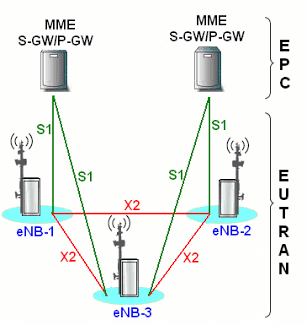

# Architecture et protocoles des réseaux 4G LTE : du réseau d'accès au cœur EPC

# Introduction

L'avènement de la 4G a marqué un tournant majeur dans l'histoire des télécommunications. Contrairement aux réseaux 2G et 3G qui séparaient le traitement de la voix et des données, la 4G repose sur une architecture entièrement basée sur le protocole IP (*All-IP Network*). Conçue pour offrir des débits élevés et une très faible latence, cette technologie s'appuie sur une structure simplifiée et distribuée.

En posant les bases du réseau "tout-IP", de la séparation stricte entre plan de contrôle et plan d'usager, et de la virtualisation des équipements, la 4G LTE a directement servi de socle technologique et conceptuel à l'élaboration de la **5G**. Comprendre la structure du réseau 4G permet ainsi d'appréhender plus facilement les évolutions architecturales des réseaux mobiles modernes.

Ce document est structuré en cinq chapitres progressifs expliquant les fondements du réseau 4G :

1. **Introduction et vue d'ensemble :** Découverte des principes clés et de la répartition entre le réseau d'accès (E-UTRAN) et le cœur de réseau (EPC).

2. **Le réseau d'accès radio (E-UTRAN) :** Étude du rôle central de l'eNodeB et des échanges directs via l'interface X2.

3. **Le cœur de réseau EPC :** Analyse des entités de contrôle (MME, HSS) et de transport des données (SGW, PGW).

4. **Cartographie des interfaces et protocoles :** Examen des liens de communication (S1, S5, S8, S6a, S11) et des piles protocolaires associées.

5. **Analyse des flux fonctionnels :** Déroulement concret des procédures d'attachement initial et de transfert intercellulaire (*Handover*).


# Chapitre 1 : Introduction et vue d'ensemble de l'architecture 4G LTE

Le réseau mobile de quatrième génération (4G LTE, pour *Long Term Evolution*) a été conçu par le 3GPP (*3rd Generation Partnership Project*) pour répondre à la croissance exponentielle du trafic de données mobiles. Contrairement aux générations précédentes (2G et 3G) qui conservaient une structure hybride commutant à la fois des circuits vocaux et des paquets de données, l'architecture 4G repose sur une refonte intégrale orientée exclusivement vers le transport de paquets IP.

<div>


## 1.1 Objectifs et principes clés du réseau LTE/EPC

L'ingénierie du réseau 4G repose sur des concepts fondamentaux visant à optimiser la latence, augmenter le débit binaire et simplifier l'interconnexion des équipements.

Pour bien appréhender cette architecture, deux notions de base doivent être posées :

- **Le terminal utilisateur (UE, *User Equipment*) :** Il désigne l'équipement final connecté au réseau mobile (téléphone cellulaire, tablette, modem 4G, objet connecté) muni d'une carte SIM.

- **Le cœur de réseau EPC (*Evolved Packet Core*) :** Il constitue l'ossature centrale du réseau 4G, responsable de *l'intelligence*, de la gestion des abonnés, de la sécurité et du raccordement aux réseaux externes comme Internet.

#### Séparation du plan de contrôle et du plan d'usager (*Control/User Plane Split*)

L'un des prérequis majeurs de l'architecture LTE/EPC est la **séparation fonctionnelle stricte** entre le traitement de la signalisation et l'acheminement des données utilisateur :

- **Le plan de contrôle (*Control Plane*)** prend en charge l'ensemble des tâches d'administration et de gestion : authentification des terminaux, gestion de la mobilité, établissement et libération des sessions, ainsi que la négociation des paramètres de qualité de service (QoS).

- **Le plan d'usager (*User Plane*)** est exclusivement dédié au transport, au routage et à la commutation des paquets de données utiles (*payload*) entre le terminal utilisateur (UE, *User Equipment*) et les réseaux de données externes.

Cette séparation autorise une mise à l'échelle indépendante des capacités de signalisation et des capacités de débit de données au sein du cœur de réseau.

### Passage au tout-IP (*All-IP Network*)

Dans les réseaux 2G/3G, la voix transitait par le domaine à commutation de circuits (CS, *Circuit Switched*), tandis que les données passaient par le domaine à commutation de paquets (PS, *Packet Switched*). La 4G élimine totalement le domaine à commutation de circuits. Tout le trafic, y compris la voix, désormais transmise via le protocole VoLTE (*Voice over LTE*), est encapsulé sous forme de paquets IP de bout en bout.

## 1.2 Organisation globale de l'architecture

L'architecture globale de la 4G se divise en deux blocs fonctionnels principaux reliés par des interfaces standardisées :

```
[ UE ] <--- Radio ---> [ E-UTRAN ] <--- Interface S1 ---> [ EPC ] <---> [ Réseaux IP / Internet ]
```

### Le réseau d'accès radio : E-UTRAN

Le réseau **E-UTRAN** (*Evolved Universal Terrestrial Radio Access Network*) constitue la partie d'accès radio du système. Contrairement aux réseaux 3G qui comportaient deux niveaux hiérarchiques (les stations de base *Node B* pilotées par des contrôleurs *RNC*), l'E-UTRAN adopte une architecture plate (*flat architecture*).

Elle est constituée d'une seule classe d'équipements distribués : les **eNodeB** (*Evolved Node B*). L'intégration des fonctions du contrôleur directement au sein de la station de base eNodeB permet de réduire considérablement les délais de transmission radio et la latence globale du réseau. 

Les eNodeB communiquent entre eux à travers une interface appelée **X2**, qui permet aux stations de base voisines d'échanger directement des informations de contrôle et de se transmettre les données d'un utilisateur lors de ses déplacements (procédure de *Handover*), sans avoir à repasser par le cœur de réseau.

### Le cœur de réseau : EPC (*Evolved Packet Core*)

Le cœur de réseau **EPC** regroupe l'ensemble des entités logiques chargées du routage des paquets, de la gestion du profil des abonnés et du contrôle de la mobilité. L'EPC interconnecte le réseau d'accès E-UTRAN aux réseaux IP externes (Internet, réseaux d'entreprise, sous-système multimédia IMS).

L'EPC s'articule principalement autour de deux axes :

1. **Les nœuds de contrôle :** la MME (*Mobility Management Entity*) et le serveur d'abonnés HSS (*Home Subscriber Server*).

2. **Les nœuds de données :** les passerelles SGW (*Serving Gateway*) et PGW (*PDN Gateway*).

L'interface standardisée **S1** assure le point de jonction entre l'E-UTRAN et l'EPC, se décomposant en **S1-MME** pour la signalisation et **S1-U** pour le transport des données usager.

# Chapitre 2 : Le réseau d'accès radio (E-UTRAN)

Le réseau d'accès radio E-UTRAN (*Evolved Universal Terrestrial Radio Access Network*) constitue l'interface intermédiaire entre l'équipement utilisateur (UE, *User Equipment*) et le cœur de réseau EPC. Dans la norme 4G LTE, l'architecture d'accès a été considérablement simplifiée par rapport aux générations précédentes afin de réduire les temps de latence et de rationaliser la gestion des ressources radio.

## 2.1 L'entité eNodeB (*Evolved Node B*)

L'eNodeB est l'élément central et unique du réseau d'accès E-UTRAN. Contrairement aux réseaux 3G (UMTS), où les fonctions de contrôle radio étaient centralisées dans une entité distante appelée RNC (*Radio Network Controller*), la 4G intègre ces responsabilités directement au sein de la station de base.

### Rôles et responsabilités

L'eNodeB remplit des fonctions complexes réparties entre le plan d'usager et le plan de contrôle :

- **Gestion de la ressource radio (*Radio Resource Management*) :** allocation dynamique des blocs de ressources temporelles et fréquentielles aux différents terminaux (ordonnancement ou *scheduling*), contrôle de puissance et gestion des canaux radio.

- **Chiffrement et protection de l'accès radio :** sécurisation des données transmises sur la voie radio (*Air Interface* / interface Uu) par chiffrement et contrôle d'intégrité.

- **Compression d'en-tête (*Header Compression*) :** réduction de la taille des en-têtes IP (via le protocole ROHC, *Robust Header Compression*) pour optimiser l'utilisation de la bande passante radio.

- **Sélection et routage :** choix de la MME (*Mobility Management Entity*) lors de l'attachement initial du terminal et routage des paquets d'usager vers la passerelle SGW (*Serving Gateway*).

### Autonomie de l'eNodeB par rapport aux générations précédentes

L'absence de RNC (*Radio Network Controller*) dans l'architecture 4G confère une autonomie décisionnelle importante à l'eNodeB. Ce choix architectural présente plusieurs avantages majeurs :

1. **Réduction de la latence :** le traitement local des décisions de réémission de paquets (protocoles HARQ et ARQ) et d'allocation de ressources supprime les allers-retours avec une entité centrale distant.

2. **Tolérance aux pannes :** la défaillance d'un eNodeB n'entraîne pas la perte d'un contrôleur central gérant des centaines d'autres sites.

3. **Mise à l'échelle simplifiée :** l'extension de la couverture ou de la capacité du réseau s'effectue par l'ajout de stations de base sans nécessiter le redimensionnement d'équipements de contrôle intermédiaires.

## 2.2 Communication inter-eNodeB : L'interface X2

Dans une architecture distribuée sans contrôleur central, les stations de base adjacentes doivent pouvoir communiquer directement entre elles. Cette communication est assurée par l'interface **X2**.

### Structure et rôles de l'interface X2

L'interface X2 interconnecte logiquement deux eNodeB voisins. À l'instar des autres interfaces LTE, elle se divise en deux composantes :

- **X2-C (*X2 Control Plane*) :** utilise le protocole de signalisation **X2-AP** (*X2 Application Protocol*) reposant sur la couche de transport SCTP (*Stream Control Transmission Protocol*). Elle permet l'échange d'informations de contrôle et de charge entre stations de base.

- **X2-U (*X2 User Plane*) :** utilise le protocole **GTP-U** (*GPRS Tunnelling Protocol User Plane*) au-dessus d'UDP/IP pour transférer les paquets de données utilisateur en attente lors des transitions de mobilité.

### Gestion du transfert intercellulaire direct (*X2 Handover*)

Lorsqu'un terminal en communication se déplace de la zone de couverture d'un eNodeB source vers un eNodeB cible, l'interface X2 assure la continuité de service :

1. **Coordination du Handover :** l'eNodeB source transmet le contexte du terminal à l'eNodeB cible via X2-C afin de préparer les ressources radio avant la bascule.

2. **Redirection des paquets (*Data Forwarding*) :** pendant la phase de transition radio, les paquets arrivant au niveau de l'eNodeB source et non encore transmis à l'UE sont transférés à l'eNodeB cible via X2-U. Cela évite la perte de paquets et garantit une interruption quasi imperceptible pour l'utilisateur.

### Coordination des interférences

L'interface X2 est également mise à profit pour échanger des indicateurs d'interférence intercellulaire (tels que l'ICIC, *Inter-Cell Interference Coordination*). Les eNodeB voisins ajustent ainsi mutuellement leurs puissances d'émission et leurs grilles d'allocation de fréquences sur les bordures de cellules.

# Chapitre 3 : Le cœur de réseau EPC (*Evolved Packet Core*)

Le cœur de réseau EPC (*Evolved Packet Core*) constitue l'intelligence et le système de transport du réseau 4G. Tandis que le réseau d'accès (E-UTRAN) gère la connexion radio, l'EPC prend en charge la gestion des abonnés, l'authentification, le routage des données et la mobilité à travers le territoire. Contrairement aux anciennes générations, l'EPC est une architecture entièrement basée sur IP, traitant la voix et les données comme de simples paquets de données.

## 3.1 Entités de la chaîne de gestion et de contrôle

Ces entités traitent exclusivement la signalisation (le "cerveau" du réseau) pour établir, maintenir et sécuriser les sessions utilisateur.

### MME (*Mobility Management Entity*)

La MME est le nœud de contrôle principal de l'EPC. Elle agit comme un gestionnaire de trafic complexe :

- **Gestion de la mobilité :** Elle suit la localisation des terminaux lorsqu'ils se déplacent, gérant les procédures de mise à jour de zone de suivi (*Tracking Area Update*).

- **Authentification et sécurité :** Elle interagit avec le HSS pour valider l'identité de l'abonné et négocier les clés de chiffrement utilisées sur la voie radio.

- **Gestion des sessions :** Elle coordonne la création et la libération des porteurs (*bearers*) qui transportent les données de l'utilisateur.

- **Signalisation NAS (*Non-Access Stratum*) :** Elle gère les échanges de messages de contrôle directement entre le terminal et le cœur de réseau, en ignorant les couches radio intermédiaires.

### HSS (*Home Subscriber Server*)

Le HSS est la base de données centrale et permanente du réseau. Il stocke :

- **Informations d'abonnement :** Droits d'accès, services autorisés (ex: itinérance internationale, accès VoLTE), et paramètres de qualité de service.

- **Données de localisation :** Il sait à quelle MME chaque abonné est actuellement rattaché.

- **Paramètres de sécurité :** Il contient les clés secrètes nécessaires pour l'authentification sécurisée des utilisateurs lors de leur connexion.

> **Pourquoi "*Home*" (dans "Home subscriber server) ?**
> 
> Le terme **Home** (*Domicile / Origine*) fait référence au **réseau d'origine de l'abonné** (*Home PLMN*), c'est-à-dire le réseau de l'opérateur chez qui le contrat a été souscrit. Quel que soit le lieu où l'utilisateur se déplace dans le monde (*roaming*), ses données de profil et ses clés d'authentification restent stockées de façon centralisée au « domicile » de son opérateur, au sein du **HSS**.

## 3.2 Entités de la chaîne de données usager

Ces entités forment le tunnel de transport physique des données utilisateur (*User Plane*).

### SGW (*Serving Gateway*)

La SGW est la passerelle de service qui sert de **relais central pour les données de l'utilisateur** au niveau local :

- **Passerelle et relais de données :** Elle reçoit les paquets IP venant du réseau radio (eNodeB) et les achemine vers la passerelle de sortie (PGW), et inversement pour le trafic descendant.

- **Maintien de la connexion en mobilité :** Lorsqu'un utilisateur se déplace et change d'antenne (eNodeB), la SGW reste fixe et modifie la destination interne des paquets. Elle évite ainsi de devoir réinterrompre la session ou d'informer le reste du réseau central à chaque changement de cellule.

- **Gestion du mode veille (*Idle*) :** Si le terminal n'émet plus de données mais reste allumé, la SGW conserve temporairement les paquets entrants et demande à la MME de réveiller le terminal (*paging*) pour lui livrer son trafic.

### PGW (*PDN Gateway*)

La PGW est le point de sortie du réseau 4G vers le monde extérieur (Internet, services IMS).

- **Interface avec les réseaux externes :** Elle alloue l'adresse IP au terminal et assure la connectivité avec les réseaux de données par paquets (*Packet Data Networks* - PDN).

- **Filtrage et QoS :** Elle applique des politiques de filtrage (Pare-feu) et garantit que les flux prioritaires (ex: appels VoLTE) reçoivent le débit nécessaire, contrairement au trafic standard (ex: navigation web).

- **Facturation (*Charging*) :** C'est ici que le volume de données consommé par l'abonné est comptabilisé pour la facturation.

## Synthèse des rôles dans l'EPC

| **Entité** | **Plan** | **Fonction principale**                                   |
| ---------- | -------- | --------------------------------------------------------- |
| **MME**    | Contrôle | Gestion de la mobilité et signalisation.                  |
| **HSS**    | Contrôle | Base de données des abonnés et sécurité.                  |
| **SGW**    | Usager   | Relais de données et continuité de connexion en mobilité. |
| **PGW**    | Usager   | Sortie vers Internet et gestion de la QoS.                |

L'EPC travaille de concert avec l'E-UTRAN grâce à l'interface **S1**. La MME utilise la partie **S1-MME** pour piloter le réseau, tandis que la SGW utilise la partie **S1-U** pour faire circuler les données. Cette architecture robuste permet de supporter des millions d'utilisateurs connectés simultanément avec une latence minimale.

# Chapitre 4 : Cartographie des interfaces et protocoles du réseau

Dans une architecture 4G LTE, le bon fonctionnement des entités (eNodeB, MME, HSS, SGW, PGW) repose sur un ensemble d'interfaces standardisées. Ces interfaces s'appuient sur des piles de protocoles spécifiques selon qu'elles appartiennent au **plan de contrôle** (transport de la signalisation) ou au **plan d'usager** (transport des paquets de données IP).

## 4.1 Interfaces de connexion de l'accès au cœur : L'interface S1

L'interface **S1** fait le lien entre le réseau d'accès radio E-UTRAN (les eNodeB) et le cœur de réseau EPC. Elle incarne la séparation stricte des plans de contrôle et d'usager :

- **S1-MME (Plan de contrôle) :** Relie l'eNodeB à la MME. Elle utilise le protocole **S1-AP** (*S1 Application Protocol*) reposant sur **SCTP** (*Stream Control Transmission Protocol*) au-dessus d'IP. SCTP garantit un transport fiable et ordonné des messages de signalisation pour l'établissement des sessions et la gestion de la mobilité.

- **S1-U (Plan d'usager) :** Relie l'eNodeB à la SGW. Elle utilise le protocole **GTP-U** (*GPRS Tunnelling Protocol - User Plane*) encapsulé dans UDP/IP. Chaque flux de données utilisateur transite dans un tunnel GTP identifié de manière unique par un TEID (*Tunnel Endpoint Identifier*).

## 4.2 Interfaces internes du cœur de réseau (Plan de contrôle)

Ces interfaces acheminent les messages administratifs pour l'authentification des abonnés et la configuration des sessions.

### Interface S6a (MME – HSS)

L'interface **S6a** permet à la MME de communiquer avec le serveur d'abonnés HSS.

- **Protocole utilisé :** **Diameter** (successeur du protocole RADIUS).

- **Rôle :** Elle sert à rapatrier le profil d'abonnement de l'utilisateur, à effectuer l'authentification mutuelle via des vecteurs de sécurité (*Authentication Vectors*), et à notifier le HSS de la localisation actuelle du terminal.

### Interface S11 (MME – SGW)

L'interface **S11** assure la communication entre la MME et la SGW.

- **Protocole utilisé :** **GTPv2-C** (*GPRS Tunnelling Protocol version 2 - Control Plane*).

- **Rôle :** La MME l'utilise pour ordonner à la SGW de créer, modifier ou supprimer des porteurs (*bearers*). Lors d'un changement de cellule ou d'un attachement, c'est via S11 que le chemin des données utilisateur est configuré.

## 4.3 Interfaces de transport de données inter-passerelles : S5 et S8

Les interfaces **S5** et **S8** relient la passerelle de service SGW à la passerelle réseau PGW. Le choix de l'interface dépend de la situation géographique et contractuelle de l'abonné.

```
       [ Réseau National / Visité ]             [ Réseau Domicile (HPLMN) ]

      +-------+       S5 / GTP-C & GTP-U       +-------+
      |  SGW  | -----------------------------> |  PGW  |  (Cas 1 : Intra-PLMN)
      +-------+                                +-------+
          |
          |           S8 / GTP-C & GTP-U       +-------+
          +----------------------------------> |  PGW  |  (Cas 2 : Inter-PLMN / Roaming)
                                               +-------+
```

### Interface S5 (Intra-PLMN)

- **Utilisation :** Utilisée lorsque la SGW et la PGW appartiennent au même opérateur (Réseau Mobile Terrestre Public ou *PLMN*).

- **Fonctionnement :** Elle transporte la signalisation (GTPv2-C) et les données utilisateur (GTP-U) au sein du réseau national de l'opérateur.

### Interface S8 (Inter-PLMN / Roaming)

- **Utilisation :** Employée lorsqu'un abonné est en situation d'itinérance (*Roaming*) à l'étranger.

- **Fonctionnement :** La SGW est située dans le réseau visité (VPLMN) tandis que la PGW reste dans le réseau d'origine de l'abonné (HPLMN). L'interface S8 traverse des réseaux d'interconnexion sécurisés (IPX/GRX). Elle garantit que la facturation et les règles de service restent sous le contrôle de l'opérateur d'origine.

## Synthèse des interfaces et protocoles

| **Interface** | **Entités reliées**             | **Plan**          | **Protocole principal** | **Rôle principal**                          |
| ------------- | ------------------------------- | ----------------- | ----------------------- | ------------------------------------------- |
| **X2**        | eNodeB $\leftrightarrow$ eNodeB | Contrôle & Usager | X2-AP / GTP-U           | Handover direct, coordination interférences |
| **S1-MME**    | eNodeB $\leftrightarrow$ MME    | Contrôle          | S1-AP / SCTP            | Signalisation d'accès et gestion de session |
| **S1-U**      | eNodeB $\leftrightarrow$ SGW    | Usager            | GTP-U / UDP             | Tunnels de données usager                   |
| **S6a**       | MME $\leftrightarrow$ HSS       | Contrôle          | Diameter                | Authentification et profils d'abonnés       |
| **S11**       | MME $\leftrightarrow$ SGW       | Contrôle          | GTPv2-C                 | Contrôle et création des porteurs           |
| **S5 / S8**   | SGW $\leftrightarrow$ PGW       | Contrôle & Usager | GTPv2-C / GTP-U         | Liaison inter-passerelles (Local / Roaming) |

# Chapitre 5 : Analyse des flux fonctionnels et procédures d'échange

Ce dernier chapitre met en application les entités, interfaces et protocoles étudiés précédemment. Il détaille les deux mécanismes fondamentaux qui régissent le fonctionnement dynamique d'un réseau 4G LTE : la procédure d'attachement initial (*Initial Attach*) et la gestion de la mobilité via le transfert intercellulaire (*Handover*).

## 5.1 Procédure d'attachement initial (*Initial Attach*)

Lorsqu'un terminal mobile (UE) s'allume ou entre dans un réseau 4G, il doit s'enregistrer auprès du cœur de réseau EPC. Cette procédure établit l'identité de l'abonné, valide ses droits d'accès et met en place un canal de communication permanent appelé **porteur par défaut** (*Default Bearer*).

**1.Demande d'attachement et sélection de la MME :**Du terminal vers le cœur de réseau via l'eNodeB.

L'UE envoie un message `Attach Request` encapsulé dans de la signalisation RRC vers l'eNodeB. L'eNodeB sélectionne une MME disponible et lui transmet le message via l'interface **S1-MME** (protocole **S1-AP**).

**2.Authentification et mise à jour de localisation :**Échanges MME - HSS.

La MME interroge le HSS via l'interface **S6a** (protocole **Diameter**) pour obtenir les vecteurs de sécurité et authentifier le terminal. Une fois l'UE authentifié, la MME met à jour sa localisation dans le HSS et rapatrie le profil de l'abonné.

**3.Création de la session et allocation IP :**Échanges MME - SGW - PGW.

- La MME envoie une requête `Create Session Request` à la SGW via l'interface **S11** (protocole **GTPv2-C**).

- La SGW relaye la requête vers la PGW via l'interface **S5** (ou **S8** en itinérance).

- La PGW attribue une **adresse IP** au terminal, définit les paramètres de qualité de service (QoS) et retourne une réponse `Create Session Response` contenant les identifiants de tunnels GTP (TEID).

**4.Activation du porteur et configuration radio :**Finalisation du porteur par défaut.

La MME ordonne à l'eNodeB de configurer la liaison radio avec l'UE (`Initial Context Setup Request`). L'eNodeB établit la connexion radio sécurisée avec le terminal et confirme le réglage à la MME.

À l'issue de cette étape, deux tunnels **GTP-U** sont actifs : un entre l'eNodeB et la SGW (interface **S1-U**), et un entre la SGW et la PGW (interface **S5**). Le terminal dispose dès lors d'une connectivité IP fonctionnelle.

## 5.2 Scénarios de mobilité : Le Handover

Le maintien d'une communication vocale ou d'une session de données active lors du déplacement d'un utilisateur repose sur le mécanisme de *Handover* (transfert intercellulaire). La 4G prend en charge deux types de Handover selon la disponibilité des interfaces.

```
                  +-----------------------------------------+
                  |         Handover basé sur X2            |
                  |  (eNodeB Source <--- X2 ---> eNodeB Cible) |
                  +-----------------------------------------+
                                       |
                   Lien X2 disponible ?|
                                       |
                      +----------------+----------------+
                      |                                 |
                   [ OUI ]                           [ NON ]
                      |                                 |
                      v                                 v
        +----------------------------+    +----------------------------+
        | - Signalisation via X2-AP  |    | - Signalisation via S1-AP  |
        | - Transfert direct de      |    | - La MME orchestre le      |
        |   données via GTP-U (X2-U) |    |   transfert entre eNodeB   |
        +----------------------------+    +----------------------------+
```

### Handover basé sur l'interface X2

C'est le scénario nominal et le plus rapide. Il intervient lorsque les deux eNodeB voisins (source et cible) sont interconnectés par un lien direct **X2**.

1. **Mesure et décision :** L'UE transmet des rapports de mesure (*Measurement Reports*) à l'eNodeB source. Lorsque le signal de la cellule cible devient supérieur à celui de la cellule source, l'eNodeB source déclenche la procédure.

2. **Préparation :** L'eNodeB source négocie la réservation des ressources radio directement avec l'eNodeB cible via l'interface **X2-C** (protocole **X2-AP**).

3. **Exécution et transfert de données (*Data Forwarding*) :** L'UE bascule ses fréquences vers l'eNodeB cible. Pendant cette brève transition, les paquets de données arrivant à l'eNodeB source sont transférés à l'eNodeB cible via un tunnel **X2-U** pour éviter toute perte de paquets.

4. **Commutation de chemin (*Path Switch*) :** L'eNodeB cible informe la MME via l'interface **S1-MME** qu'il gère désormais l'UE. La MME ordonne à la SGW de basculer le tunnel **S1-U** vers le nouvel eNodeB.

### Handover basé sur l'interface S1

Lorsque l'interface X2 n'est pas déployée entre deux stations de base, ou si le lien X2 est momentanément indisponible, le réseau bascule sur un Handover basé sur l'interface **S1**.

- **Rôle de la MME :** Au lieu d'une communication directe inter-eNodeB, la MME sert de relais central. L'eNodeB source envoie sa demande de transfert à la MME (`Handover Required`), qui la transmet à l'eNodeB cible (`Handover Request`).

- **Inconvénients :** Cette procédure génère un volume de signalisation plus important dans le cœur de réseau et introduit une latence légèrement supérieure à celle du Handover X2. Elle garantit toutefois une continuité de service absolue sur l'ensemble de la couverture réseau.

## Synthèse globale du cours

Au terme de ces 5 chapitres, l'architecture 4G LTE se distingue par :

- Une architecture **plate et simplifiée** (E-UTRAN) centrée sur l'eNodeB pour réduire la latence radio.

- Un cœur de réseau **EPC exclusivement IP** séparant strictement le plan de contrôle (MME, HSS) du plan d'usager (SGW, PGW).

- Des **interfaces et protocoles standardisés** (S1, X2, S6a, S11, S5/S8) assurant l'interopérabilité, l'authentification sécurisée et une mobilité fluide sans interruption de service.

---

#### Avertissement

Ce texte s'inspire du chapite #1 du cours *Comprendre la 4G* offert sur la plateforme FunMocc par MinesTelecom . 

Le texte a été rédigé en partie à l'aide d'outils LLM tels que Gemini et Mistral, puis vérifié, corrigé et modifié à la main.

---


